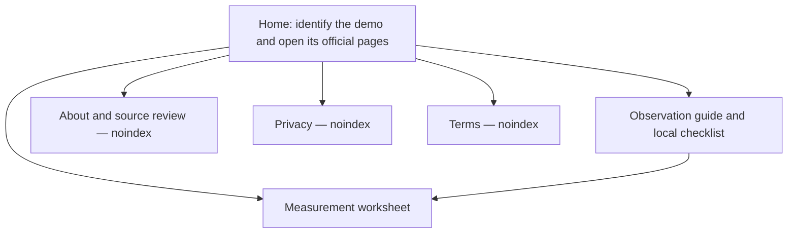

# Worm Capitalist scope repair — 2026-10-09

Prepared by Codex agent before implementation. Scope: the released HTML5/Windows demo by Tikotey; the full Steam game remains unreleased. Public itch.io and Steam official listings identify both. No logged-in gameplay or release-date prediction is claimed.

P0 player task: find the correct demo, then compare two personally measured sessions without invented game coefficients. P1: remember a small set of observation checks locally.

| Page | Intent | Main information | Main action | Failure fallback |
|---|---|---|---|---|
| / | Identify the actual game and demo | Official developer/platform distinction, supported feature overview | Open developer or Steam page; choose a tool | Stable official pages, no pinned game build iframe |
| /profit-calculator/ | Compare two observed balances | Explicit arithmetic, units, calibration example, assumptions | Enter two runs, compare, clear | Blank/invalid/overflow input shows explanation; no made-up defaults |
| /walkthrough/ | Make a reproducible personal observation | Baseline, purchase, skill, reset and worker observations in one place | Check progress, filter, copy remaining | Session-only on storage failure; manual copy text on clipboard failure |
| /about/ | Understand authorship and sourcing | Hlele site identity, agent review, exact source dates and limitations | Open source listings/contact | No assertion of personal gameplay |
| /privacy-policy/ | Understand browser data | Checklist storage, worksheet state, external hosting | Clear checks or browser storage | Storage errors visible |
| /terms/ | Understand use of tools and ownership | Independent reference, user measurements, external game ownership | Return to tools/official game | No gameplay/earning guarantee |

Retire the other twelve old routes as real 404s. Preserve source snapshots before editing. Remove unused components and fixed itch game-build URL. Inspect legacy public media; without evidenced reuse rights remove those media from the deployable public directory, preserving archived bytes and hashes in quality/. Keep the original decorative favicon with source record. Sitemap contains three intentional indexable routes; legal/about are noindex. Add vercel.json to enforce npm run build, then build, inspect 390/768/1024/1440 px, test real interactions and formula calibration, and finalize the evidence manifest only after those checks.
